# Chalenge 1 Documentation:


## Step 1 - ~~Secure the Keys~~ Setting Up the VM:

    1. Go to your AWS home page.

    2. Ensure you are on the correct region for your permissions.

    3. Select EC2 machine by either:
        - Typing it in the search bar.
        - Clicking 3 horizonal bars on the left hand side of page under AWS logo  --> 
                All Services    -->   EC2. (Please refer to image below).

    4. Click on orange "Launch Instance" button when on the EC2 page.

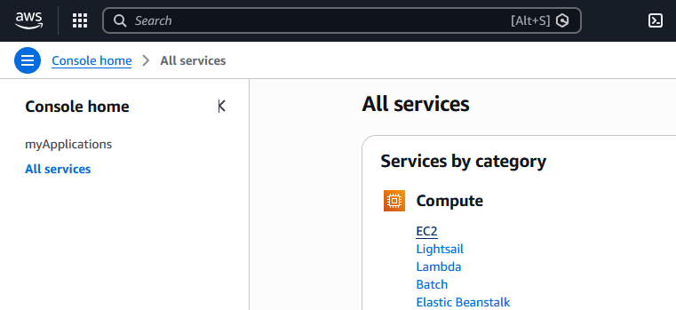

### Launch an Instance Settings (See images below for reference): 

        Name and tags: se-<name>-nginx-server

        Application and OS Images (Amazon Machine Image):
            - Quick Start Tab: Ubuntu (Third default option).
            - Amazon Machine Image (AMI): Amazon Linux 2023 kernel-6.1 AMI (Top default as of 01/2026)
            - Architecture: 64-bit(x86)

        Instance Type: t3.micro

        Key pair (login):
            - Use your own personal Key pair name
            - Should be named se-<name>-key-pair
            - You should have the matching .pem file (must be kept private, do not upload file/contents)
            - This file should be saved on your local machine under C://Users/<username>/.shh/ (Front letter(C:) may vary from machine to machine)
            - If you don't have one you will need to create one

        Network Settings:
            Firewall:
                - Select existing security group
                - Under "Common security groups" drop-down, select se-<name>-node20-app-sg

                If you don't have one preset:
                    1. Press edit button in top-right hand corner of "Network Settings" box.
                    2. Leave "VPC", "Subnet", "Availability Zone" and "Auto-assign public IP" as defaults.
                    3. Under "Security group name - required": se-<name>-node20-app-sg
                    4. Under "Description - required": replace "launch-wizard-18" with the security group name. The text " created" onward should remain untouched.
                    5. Add the following 3 "Inbound Security Group Rules" (See image below, Order unimportant):

                        - Type: ssh, Protocol: TCP, Port range: 22, Source type: Anywhere, Source: 0.0.0.0/0, Description - Optional: <Leave blank>

                        - Type: HTTP, Protocol: TCP, Port range: 80, Source type: Anywhere, Source: 0.0.0.0/0, Description - Optional: <Leave blank>

                        -Type: Custom TCP, Protocol: TCP, Port range: 3000, Source type: Anywhere, Source: 0.0.0.0/0, Description - Optional: <Leave blank>
        
        Configure storage:
            - 1x 8 Gib gp3 Root volume, 3000 IOPS, Not encrypted

        Advanced Settings:
            - Leave untouched.
    
    - Once all Instance Settings have been checked, ensure "Number of instances is 1" and press the orange "Launch instance" button on the right hand side of the page.


        


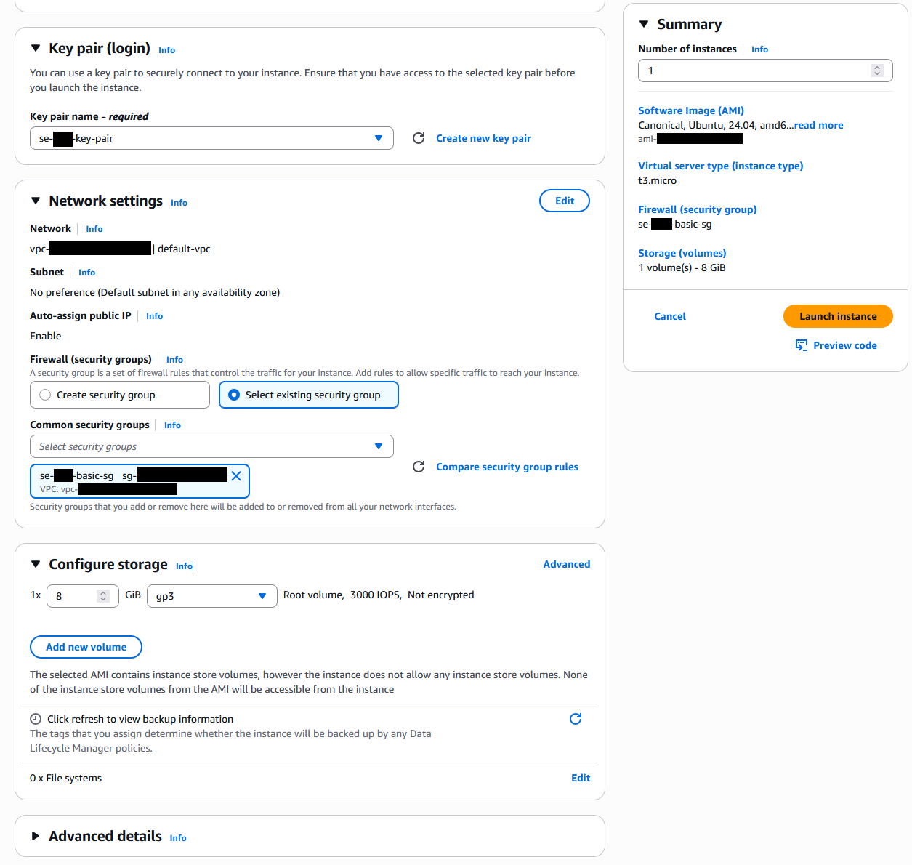


## Step 2 - ~~Ascend From Dakrness~~ Connecting to the VM:

    1. Press the "Connect to instance" button under the "Connect to your instance" section.
    2. Select the "SSH client" tab
    3. Open Git Bash on your computer
        - 'cd' into you .ssh folder
        - This will vary depending on your computers file structure
        - For me I use 'cd' to return to c/Users/<username> and then use 'cd .ssh' to enter the .ssh folder.
        - Ensure the orange file path ends in .ssh and your Key-Pairs .pem file is in the current folder
            - Use 'ls' to check it is in the folder if you are unsure. Either use cd to move into the folder it is stored in or create a .ssh folder and/or move the Key-Pairs .pem file into the .ssh folder.


    1. Run: >chmod 400 "se-<name>-key-pair.pem" to restrict file access
    2. On the AWS webpage, there is a command at the botton of the Connect webpage we were on earlier under the SSH client tab (this should still be open).
        - Copy the command titled "Example:".
        - It sould look like: ssh -i "se-<name>-key-pair.pem" <operationSystem@IpAddress>.<AWS Server>.compute.amazonaws.com
    3. Once copied, right click on the Git Bash command line and press paste. Then press enter to run the command.
        - Enter yes into the command line if the following error appears:
            <number> key fingerprint is SHA256:<number>
            This key is not known by any other names.
            Are you sure you want to continue connecting (yes/no/[fingerprint])?
    - Your Git Bash should show your current file location as <machineName@IP>:~

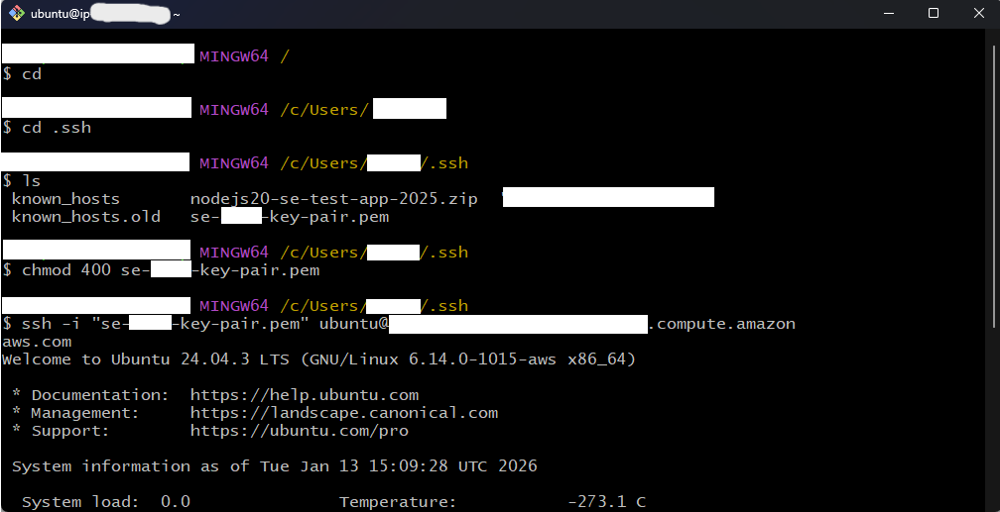

## Step 3 - ~~Rain Fire~~ Installing and running nginx:

    1. Run the command >sudo nano deploy-nginx.sh
        - This opens the text editor
    2. Copy the following code into nano:

```
    #!/bin/bash

    # update packages
    sudo apt update -y
    sudo apt upgrade -y

    #install nginx
    sudo apt install nginx

    #restart nginx
    sudo systemctl restart nginx

    #enable nginx - make nginx start process
    sudo systemctl enable nginx
```
        
        - This is the same code in the "scripts/deploy-nginx.sh" file in this GitHub repo.

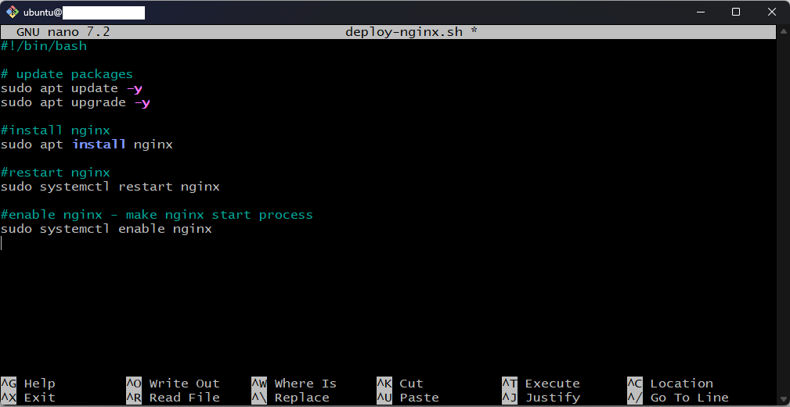

    3. Press 'ctrl + X' to exit, 'y' to save our changes, 'enter' to save the changes to the file "deploy-nginx.sh"

    Optional: Run >cat deploy-nginx 
                to check the file contents matches the code above

    4. Update the execution permissions so you can run the file using >sudo chmod +x deploy-nginx.sh

    5. Run the deploy-nginx.sh file with the following command: ./deploy-nginx
        -either add a -y after the command or,
        -Along the way, the script will prompt you to enter [y/n], enter 'y' at this point to continue


## Step 4 - ~~Unleash the Hordes~~ Transferring the zipped file to the VM:

    1. Open a second Git Bash Terminal on your main machine that is in your machines file directory.
        - You can open this second window by right clicking on the top of the bar and selecting open new window.

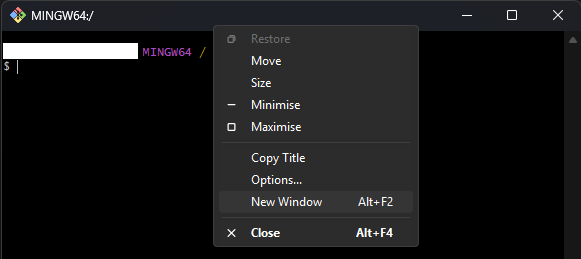

    2. Locate the file path of the zipped application folder. In our case, it is named "nodejs20-se-test-app-2025.zip" and is stored in our /Downloads folder.

    3. You want to run the following command:
        >scp -i <Key-Pairs.pem> <FileToTransfer> <PublicIPv4Address>
            - To get the IPv4 Address, you can find it on the instance page on AWS under "Public IPv4 Address". It has been redacted with a blue box in the screenshot below.

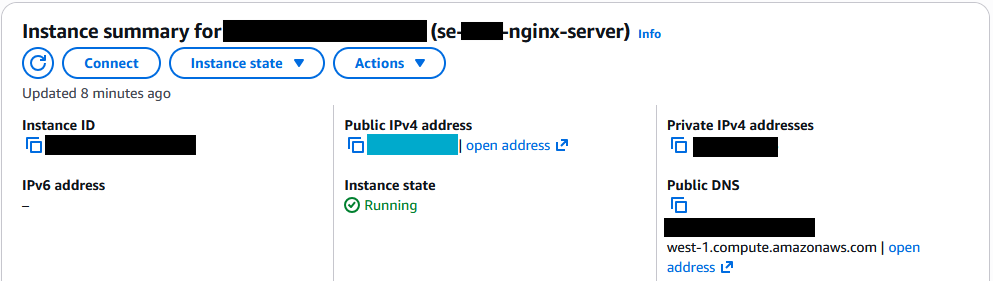

    3. Continued:
        - I will be running the following the command from the c/Users/<username> folder.
            'scp -i ~/.ssh/se-<username>-key-pair.pem ~/Downloads/nodejs20-se-test-app-2025.zip ubuntu@<Public IPv4 Address>:~'
        - If you run into a message about a fingerprint, type 'yes'.
    
    4. Run 'ls' in your VM Bash console to check the transfer completed correctly.


        

## Step 5 - ~~Skewer the Winged Beast~~ Unzip Folder:

    1. Run 'sudo apt install unzip' to install the unzip program. 
        - I have ommited a lot of the command line responses for readability

    2.  Run 'unzip nodejs20-se-test-app-2025.zip'

    3. If you wish, you can run 'ls' and you should see an unzipped version of your folder has been added.

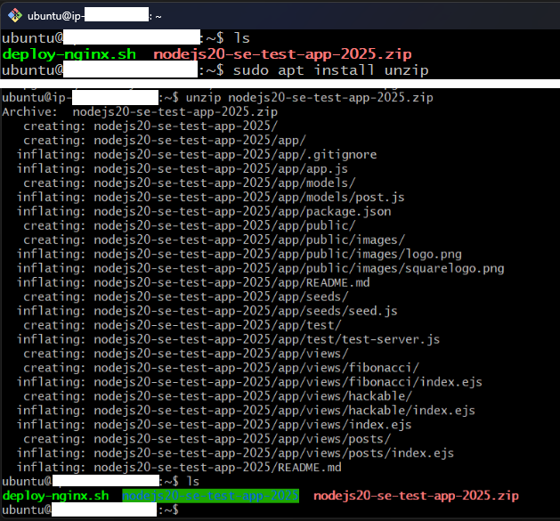


## Step 6 - ~~Wield the Fists of Iron~~ Install NodeJS Version 20:

    1. Run 'sudo bash -c "curl -fsSL http://deb.nodesource.com/setup_20.x | bash - && sudo apt install -y nodejs"' to dowload specifically NodeJS version 20 and install it.
    2. Then run 'node -v' to ensure you have the correct version installed

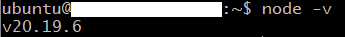

This is an example and your version may differ, just make sure the first number is 20.


## Step 7 - ~~Raise Hell~~ Install App:

    1. Run 'cd nodejs20-se-test-app-2025/app' to enter the freshely unzipped folder and then enter the app folder within that. 
        - This can be executed as two seperate 'cd' commands.

    2. Run 'npm install' to install the app.

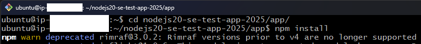


## Step 8 - ~~Freedom~~ Run the App and Revel in Glory:

    1. Run 'npm start app.js' to start the App.

    2. In a browser of your choice: go to http://<Public IPv4 Address>:3000/
        - The IPv4 Address is the same one from earlier.
        - Makes sure it is HTTP and not HTTPS.

    

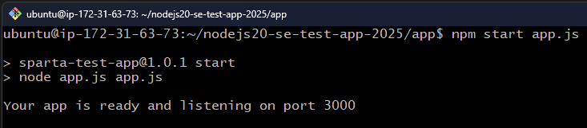

### Hopefully, you should have a site that looks like this:

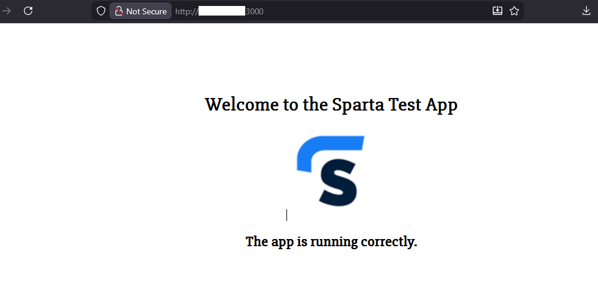


# Optional Challenge: Bash Script to automate challenge 1

    - This code can also be found in scripts/deploy-app.sh

```
#!/bin/bash

# This assumes that the zip file has already been transported over 
# and is lovated in the current folder

#install unzip and unzip file
sudo apt install unzip
unzip nodejs20-se-test-app-2025.zip

# install Node version 20
sudo bash -c "curl -fsSL http://deb.nodesource.com/setup_20.x | bash -"
sudo apt install -y nodejs
node -v

# cd into app directory
cd nodejs20-se-test-app-2025/app

# install and run app
npm install
npm start app.js
```