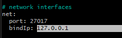

AWS regions are important because of latency, but also its like Tesco Extra and Tesco Express.
A datacenter may be closer and have less latency, but may not have all services.

MongoDB uses GPG keys to send data
Acts similar to Key-Value pairs
Everyone can send data, but only the person with the GPG key can open it.

sudo apt install gnupg curl -y
sudo apt update   // to add mongoDB to our app list
## Install correct mongodb version, version 7
curl -fsSL https://www.mongodb.org/static/pgp/server-7.0.asc | \

   sudo gpg -o /usr/share/keyrings/mongodb-server-7.0.gpg \

   --dearmor
### alt command
curl -fsSL https://www.mongodb.org/static/pgp/server-7.0.asc | sudo gpg -o /usr/share/keyrings/mongodb-server-7.0.gpg --dearmor

## 
echo "deb [ arch=amd64,arm64 signed-by=/usr/share/keyrings/mongodb-server-7.0.gpg ] https://repo.mongodb.org/apt/ubuntu jammy/mongodb-org/7.0 multiverse" | sudo tee /etc/apt/sources.list.d/mongodb-org-7.0.list
sudo apt update

## install further packages
sudo apt install -y mongodb-org=7.0.6 mongodb-org-database=7.0.6 mongodb-org-server=7.0.6 mongodb-mongosh=2.1.5 mongodb-org-mongos=7.0.6 mongodb-org-tools=7.0.6

mongod --version
    - should output "version": "7.0.6",

## Should show as inactive at the moment
sudo systemctl status mongod

## install files and config files are stored in /etc folder
cd /etc && ls
    - look for mongod.conf

sudo nano mongod.conf
    - Inside mongo.conf:
        -  Under '# network interfaces' -> change BindIP to  0.0.0.0
        - This changes the db to allow all incoming traffic, for this we want this but generally wouldn't

cat mongod.conf  - to check contents has changed
sudo systemctl restart mongod   - to restart mongod and apply changes

## Environment variables
    - set at an OS level, set with export, called using $VARNAME

cd ..   - back to ~ folder
export DB_HOST=mongodb://DB-IP-ADDRESS:27017/post   - spelling error
export DB_HOST=mongodb://DB-IP-ADDRESS:27017/posts   
    - export to set env variable
    - DB_HOST - env var name

sudo systemctl start mongod
sudo systemctl status mongod

### Using public ip instead of DB-IP-ADDRESS 
export DB_HOST=mongodb://<PublicIP>:27017/posts
sudo systemctl start mongod
sudo systemctl status mongod

### if it wasnt working, change permission settings
    -sudo chown -R mongodb:mongodb /var/lib/mongodb
    -sudo chown mongodb:mongodb /tmp/mongodb-27017.sock
    -sudo service mongod restart

### Second terminal
sudo apt update && upgrade -y
sudo nano app-deploy.sh
sudo chmod +x app-deploy.sh
./app-deploy.sh

cd se-sparta-test-app/app
### populate db
node seeds/seed.js
npm start app.js

## in browser 
http://<publicIP>:3000/posts