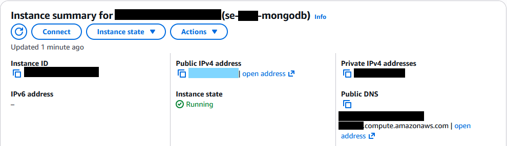
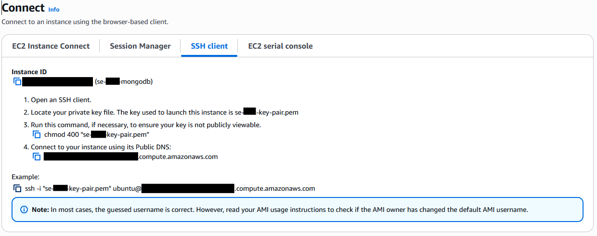
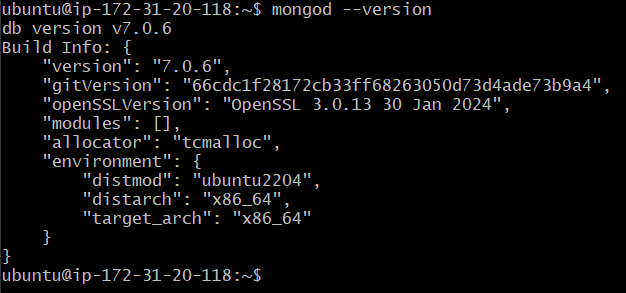
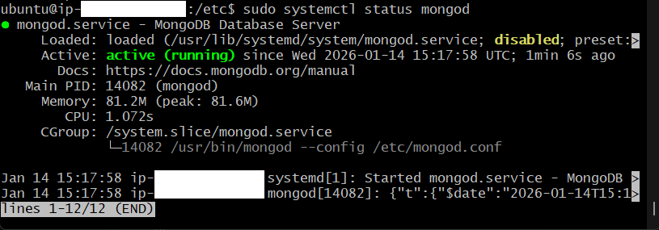
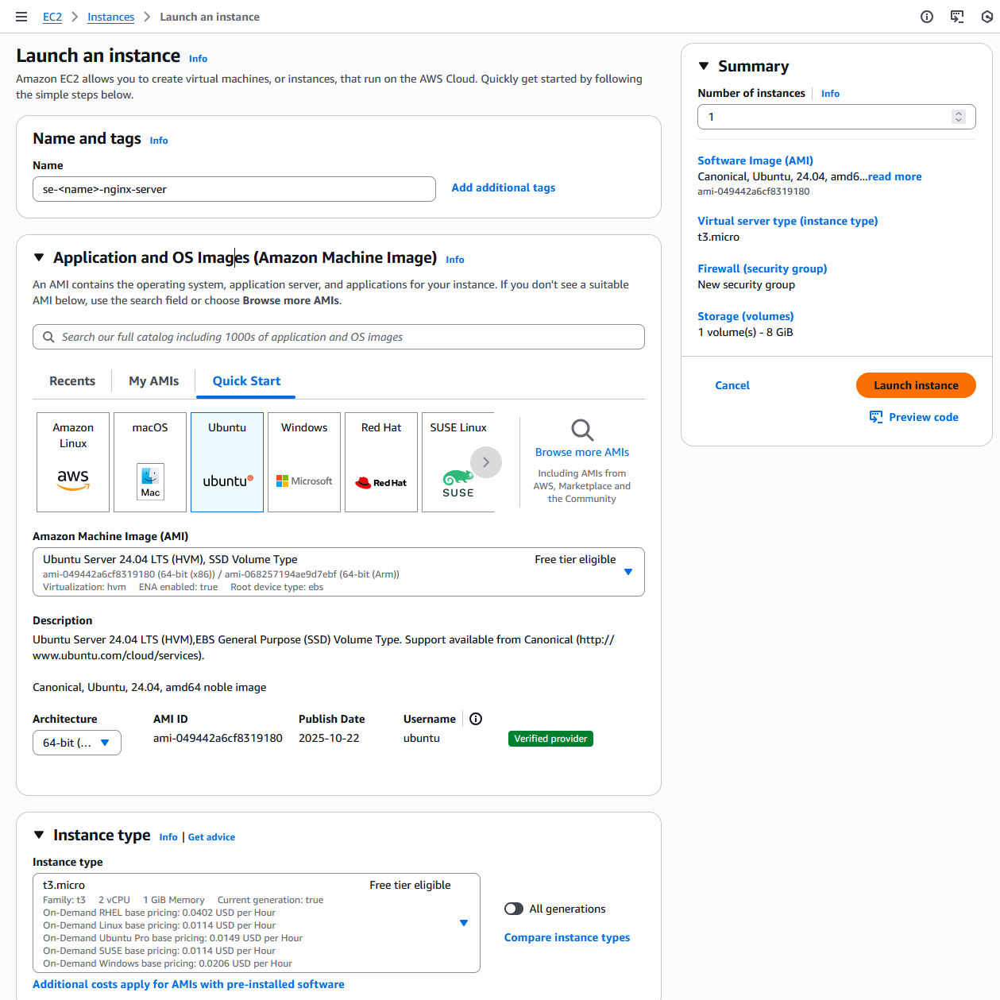
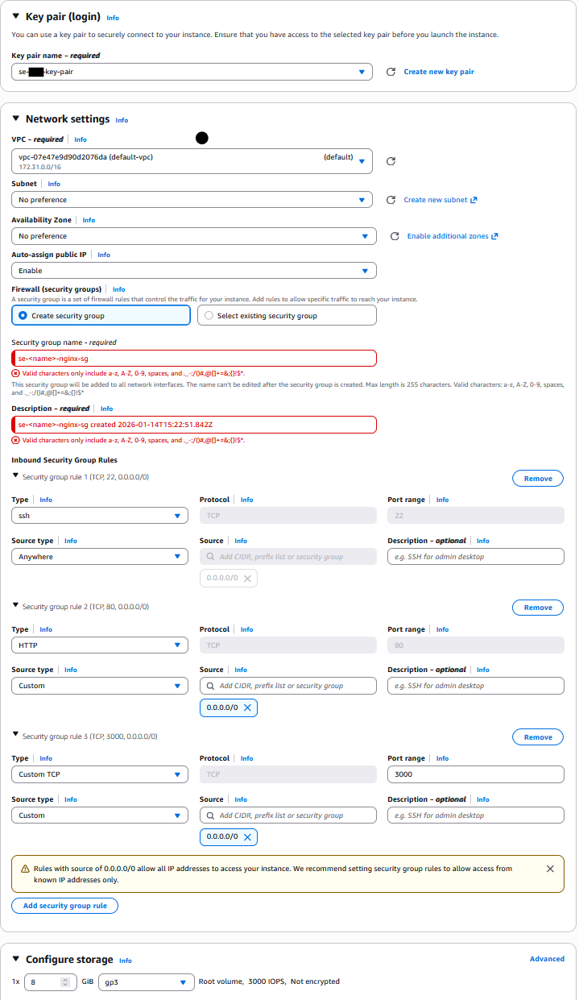
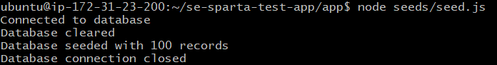

#### This setup is run on Ubuntu Linux using GitBash

# Setting Up EC2 Database Machine

    1. Go to your AWS home page.

    2. Ensure you are on the correct region for your permissions.

    3. Select EC2 machine by either:
        - Typing it in the search bar.
        - Clicking 3 horizonal bars on the left hand side of page under AWS logo  --> 
                All Services    -->   EC2. (Please refer to image below).

    4. Click on orange "Launch Instance" button when on the EC2 page.

    - 

## Select the following settings for the Database VM

    - 
    - 


## SSH into the DB VM Using GitBash

    - You will be brought to a page that looks like this:

    - 

    - Make note of the IP blocked out in blue, we will need this later. It will be referred to a the 'DatabaseIP'.

    - Then click the Connect button in the top-left. You will be redirected to the page below:

    - 

    - In your Git Bash terminal, use 'cd' to change folders until you are in the folder containing the se-<name>-key-pairs.pem file.

    -Then Run the following command:

    ```
    chmod 400 "se-<name>-key-pair.pem"
    ```

    - Follow this with the command under the 'Example:' section on the AWS Connect page.
    
    It should look something like:
    ```
    ssh -i "se-<name>-key-pair.pem" ubuntu@ec2-<DatabaseIP>.<AWS Region>.compute.amazonaws.com
    ```
        - Enter 'yes' to any fingerprint warnings.


## Installing MongoDB Version 7 and Dependencies

    - As we are starting out VM for the first time, first lets update all packages with:

    ```
    sudo apt update && sudo apt upgrade -y
    ```

    - From here run the following commands

    ```
    # We firstly need to install GPG as MongoDB uses GPG Keys.
    sudo apt install gnupg curl -y

    # We then need to add MongoDB to our app list.
    sudo apt update

    # Now to install MongoDB Version 7 run the next two commands:

    curl -fsSL https://www.mongodb.org/static/pgp/server-7.0.asc | sudo gpg -o /usr/share/keyrings/mongodb-server-7.0.gpg --dearmor

    echo "deb [ arch=amd64,arm64 signed-by=/usr/share/keyrings/mongodb-server-7.0.gpg ] https://repo.mongodb.org/apt/ubuntu jammy/mongodb-org/7.0 multiverse" | sudo tee /etc/apt/sources.list.d/mongodb-org-7.0.list

    # Again we need to update our app list:
    sudo apt update

    # Install further packages for MongoDB:
    sudo apt install -y mongodb-org=7.0.6 mongodb-org-database=7.0.6 mongodb-org-server=7.0.6 mongodb-mongosh=2.1.5 mongodb-org-mongos=7.0.6 mongodb-org-tools=7.0.6

    # Check the version is with the following command:
    mongod --version
    ```

    - Under 'version', it should start with a '7.' as shown below:

    - 


## Configuring MongoDb

    - If were to run 'sudo systemctl status mongod', a message should come back saying the database is inactive.
    Now lets fix that.
        - Use 'ctrl + c' to exit the message.

    - We will now update the config file.

    ```
    # Change directory to the etc folder.
    cd /etc

    # There should be a file called mongod.conf in this directory, you can check for it using:
    ls

    # We are now going to modify this with the text editor, so type:
    sudo nano mongod.conf
    ```

    - Under '# network interfaces', change BindIP to  0.0.0.0 to allow any IP to modify the database.
    
    - The image below shows the number we need to change.
    - 

    - To save the changes type:
        1. 'ctrl + x'
        2. 'y'
        3. 'Enter'

    - If you want, you can run 'cat mongod.conf' to chack the changes  persisted.

    
## Running MongoDB

    - Run the following:

    ```
    # Return to the home directory
    cd

    # Restart MongoDB to apply changes
    sudo systemctl restart mongod

    # Check the database is running
    sudo systemctl status mongod
    ```

    - You should get a running message like this:

    - 


# Setting Up Second EC2 Machine

**Make sure to use a second instance**

    - Set up a second EC2 VM with the following setting.
    -If you have a prexisting security group with the same settings, please use that instead.

    - 
    - 

    - Then use SSH to connect to the machine in a **SEPERATE** Git Bash terminal.
    - Use the same instructions as with the first Virtual Machine.


## Prepare Second VM to Connect

    - Run the following:
    
    ```
    # update system 
    sudo update

    # Open the following file and 
    sudo nano app-deploy.sh
    ```

    - Paste the following in the app-deploy.sh file.

    ```
    #!/bin/bash

    # update packages
    sudo apt update -y

    # upgrade packages
    sudo apt upgrade -y

    # install git if it's not there
    sudo apt install git -y

    # get the app code
    git clone https://github.com/LSF970/se-sparta-test-app.git

    # install nginx
    sudo apt install nginx -y

    # install sed
    sudo apt install sed -y

    # use sed to change nginx config
    sudo sed -i '51c\proxy_pass http://127.0.0.1:3000;' /etc/nginx/sites-available/default

    # restart nginx
    sudo systemctl restart nginx

    # enable --> makes the process a startup process
    sudo systemctl enable nginx

    # install curl
    sudo apt install curl -y

    # download nodejs 20.x
    sudo bash -c "curl -fsSL https://deb.nodesource.com/setup_20.x | bash -"

    # install nodejs 20
    sudo apt install nodejs -y

    # cd into repo
    cd se-sparta-test-app

    # cd into app folder
    cd app

    # npm install
    sudo npm install

    # install pm2 --> process manager for node apps
    sudo npm install pm2 -g

    # kill all node processes
    pm2 kill

    # start the app
    pm2 start app.js
    ```

    - To save the changes type:
        1. 'ctrl + x'
        2. 'y'
        3. 'Enter'


    - Update Permissions and run
    ``` 
    # Update Permissions and execute:
    sudo chmod +x app-deploy.sh
    ./app-deploy
    ```

    - Add a system variable for the database host
    ```
    cd  
    export DB_HOST=mongodb://<DatabaseIP>:27017/posts
    - 
    ```
    
    - Go into the app folder and populate database
    ```
    cd se-sparta-test-app/app

    # populate database
    node seeds/seed.js
    ```

    - You should get the following message

    - 

    - Then start the server
    ```
    npm start app.js
    ```

