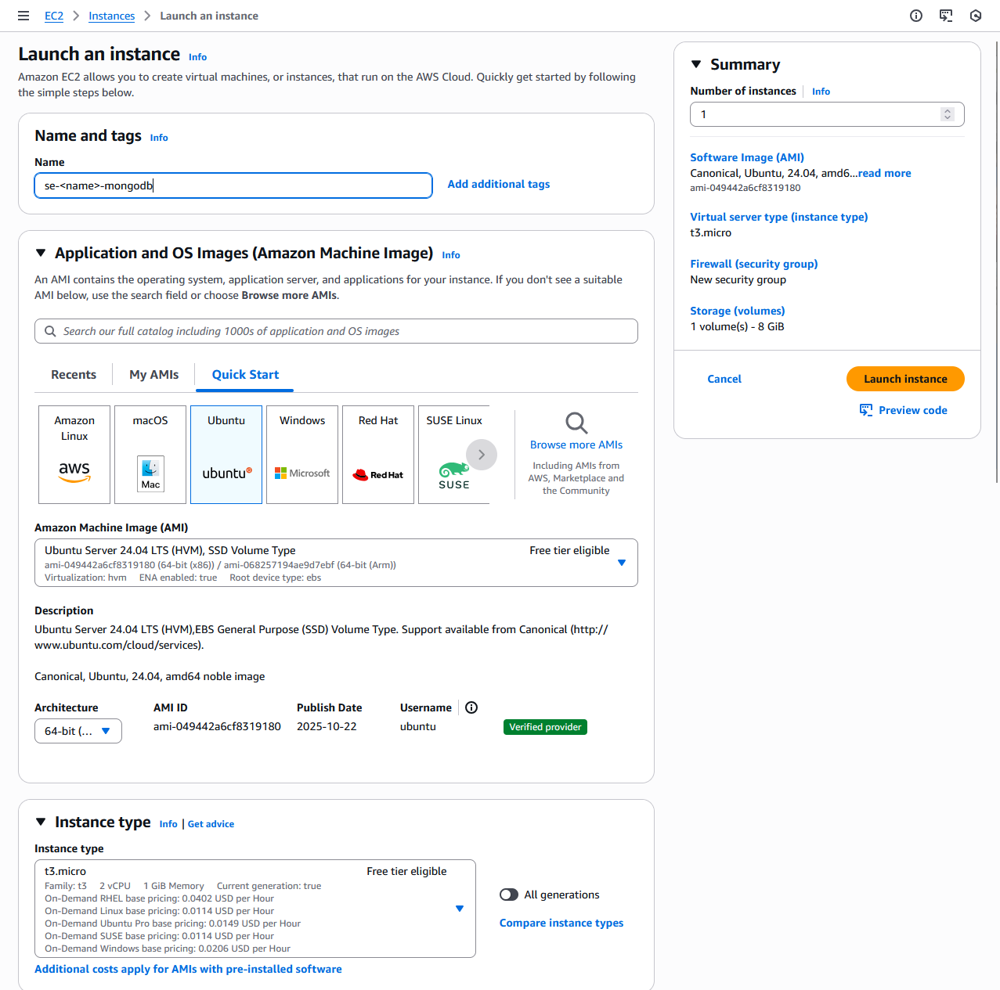
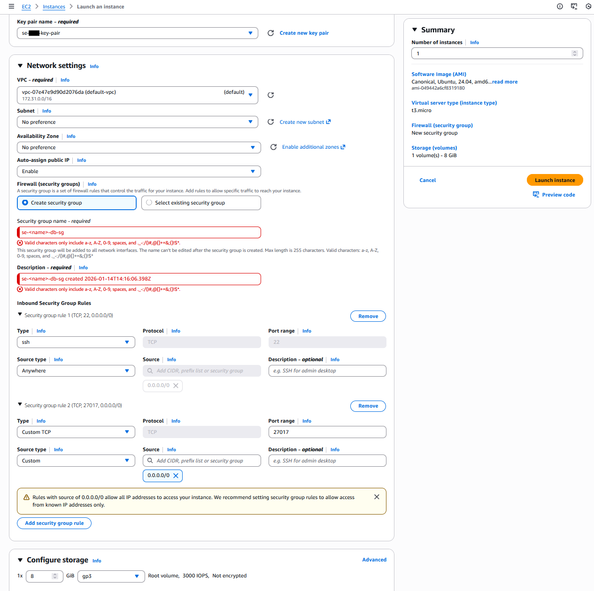
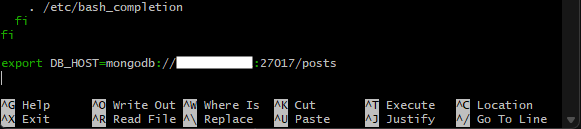
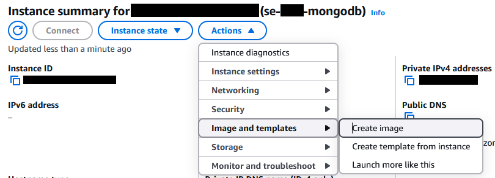
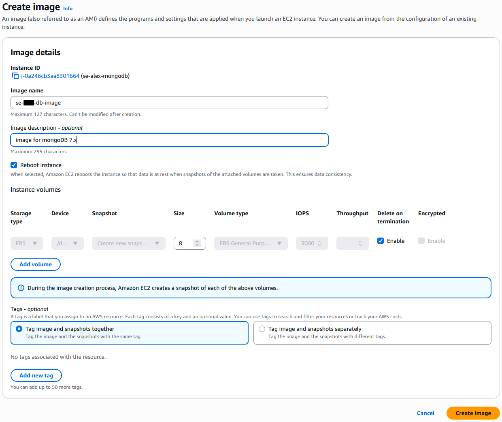
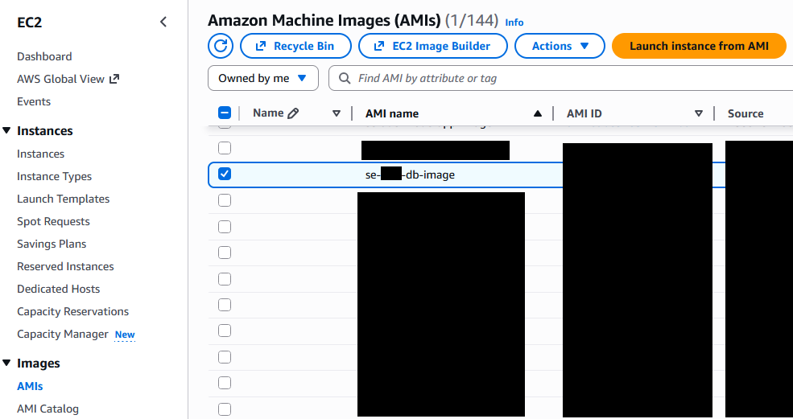
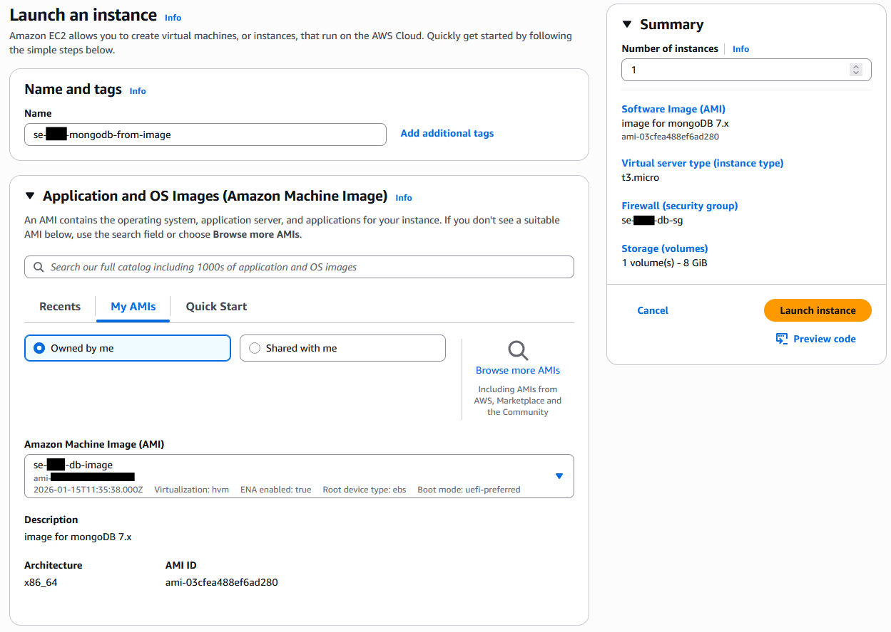
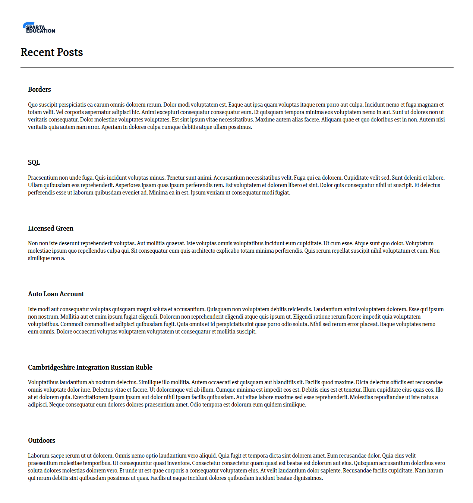

#### This setup is run on Ubuntu Linux using GitBash

# Setting Up EC2 Database Machine

    1. Go to your AWS home page.

    2. Ensure you are on the correct region for your permissions.

    3. Select EC2 machine by either:
        - Typing it in the search bar.
        - Clicking 3 horizonal bars on the left hand side of page under AWS logo  --> 
                All Services    -->   EC2. (Please refer to image below).

    4. Click on orange "Launch Instance" button when on the EC2 page.

    - 

## Select the following settings for the Database VM

    - 
    - 


## SSH into the DB VM Using GitBash

    - You will be brought to a page that looks like this:

    - 

    - Make note of the IP blocked out in blue, we will need this later. It will be referred to a the 'DatabaseIP'.

    - Then click the Connect button in the top-left. You will be redirected to the page below:

    - 

    - In your Git Bash terminal, use 'cd' to change folders until you are in the folder containing the se-<name>-key-pairs.pem file.

    -Then Run the following command:

    ```
    chmod 400 "se-<name>-key-pair.pem"
    ```

    - Follow this with the command under the 'Example:' section on the AWS Connect page.
    
    It should look something like:
    ```
    ssh -i "se-<name>-key-pair.pem" ubuntu@ec2-<DatabaseIP>.<AWS Region>.compute.amazonaws.com
    ```
        - Enter 'yes' to any fingerprint warnings.


## Install and start MongoDB

    - Create a script to automatically install it

```
# Open nano
sudo nano deploy-mongo.sh
```

    - Paste the following into the text editor:

```
#!/bin/bash

# update and upgrade
sudo apt update -y
sudo apt upgrade -y

# install gnupg for the GPG keys and curl
sudo apt install gnupg curl
sudo apt update -y

# add the GPG key whiock MongoDB packages are signed in with to 
# add --yes flag to overwrite the existing key
curl -fsSL https://www.mongodb.org/static/pgp/server-7.0.asc | sudo gpg -o /usr/share/keyrings/mongodb-server-7.0.gpg --dearmor --yes

echo "deb [ arch=amd64,arm64 signed-by=/usr/share/keyrings/mongodb-server-7.0.gpg ] https://repo.mongodb.org/apt/ubuntu jammy/mongodb-org/7.0 multiverse" | sudo tee /etc/apt/sources.list.d/mongodb-org-7.0.list

#update again
sudo apt update -y

# install mongodb
sudo apt install -y mongodb-org=7.0.6 mongodb-org-database=7.0.6 mongodb-org-server=7.0.6 mongodb-mongosh=2.1.5 mongodb-org-mongos=7.0.6 mongodb-org-tools=7.0.6

# install sed to update ip
sudo apt install sed

# configure bind IP (not using sudo nano on mongod.conf)
sudo sed -i "s/bind/Ip: 127.0.0.1/bindIp: 0.0.0.0/" /etc/mongod.conf

# Potential permissions error:
sudo chown -R mongodb:mongodb /var/lib/mongodb
sudo chown mongobd:mongodb /tmp/mongodb-27017.sock

#start mongodb as its off by default
sudo systemctl start mongod

# enable mongodb as will not be enabled by default
sudo systemctl enable mongod
```

### Execute file
```
    source ./deploy-mongo.sh
```

# In your second VM

    - SSH into the machine using the same instructions from before.

    - Create another script file with the following command:
```
sudo nano app-deploy.sh
```

    - Paste in the following

```
#!/bin/bash

# update packages
sudo apt update -y

# upgrade packages
sudo apt upgrade -y

# install git if it's not there
sudo apt install git -y

# get the app code
git clone https://github.com/LSF970/se-sparta-test-app.git

# install nginx
sudo apt install nginx -y

# install sed
sudo apt install sed -y

# use sed to change nginx config
# remove line 51, c means clear all, then replace with proxy_pass... file in etc/...
sudo sed -i '51c\proxy_pass http://127.0.0.1:3000;' /etc/nginx/sites-available/default

# restart nginx
sudo systemctl restart nginx

# enable --> makes the process a startup process
sudo systemctl enable nginx

# install curl
sudo apt install curl -y

# download nodejs 20.x
sudo bash -c "curl -fsSL https://deb.nodesource.com/setup_20.x | bash -"

# install nodejs 20
sudo apt install nodejs -y

# cd into repo
cd se-sparta-test-app

# cd into app folder
cd app

# npm install
sudo npm install

# install pm2 --> process manager for node apps
sudo npm install pm2 -g

# kill all node processes
pm2 kill

# start the app
pm2 start app.js
```

    - Run app-deploy.sh

```
    source ./app-deploy.sh
```


## To make the IP a permanent variable
sudo nano .bashrc

    - Scroll to the bottom of the page

    - Add the command: 'export DB_HOST=mongodb://<DatabaseIP>:27017/posts'

    - Rerun the ./bashrc to update the environment variables

```
source ~/.bashrc
```

    - You can check is saved with: 'printenv DB_HOST'




## Create image of OS

    - Stop your instance on using the 'Image State' option
    - Then select 'Create an Image' as shown below 



    - Select the following settings and press the orange 'Create Image' button.




    - When ready it will appear here:



## Run VM with Image

    - Go to create EC2 instance, just like when making the first VM

    - Instead of creating from the Ubuntu image, we are going to select an AMI as shown below.
    - All other settings are the same.
    



## The IP will be different so we need to update out Environment Variable

    - From the root folder, run:
```
sudo nano .bashrc
```

    - Inside the file, go to the bottom and update the IP to the new machine's PublicIP.


    - Rerun the ./bashrc to update the environment variables

```
source ~/.bashrc
```


## Back on your app deploy machine, rerun the following:

```
cd
se-sparta-test-app/app
node seeds/seed.js
npm start app.js
```

## Then in a browser, go back to the following webpage:
http://<AppPublicIP>:3000/posts

    - It should look like this (the text itself will look different):

