# Monitoring

## Turn on Monitoring
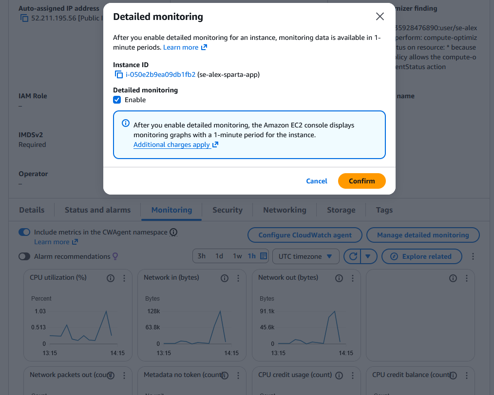

    - Add dashboard
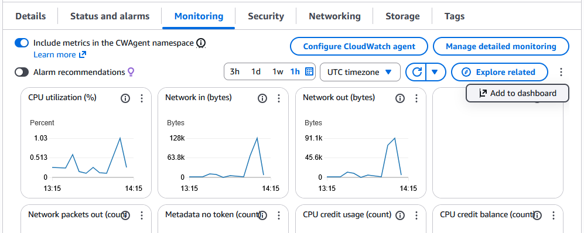

    - Create New Button then:
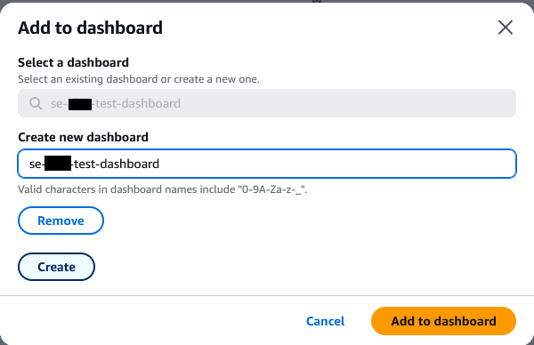

    - Click add to Dashboard
    
    - You should end up with something like:

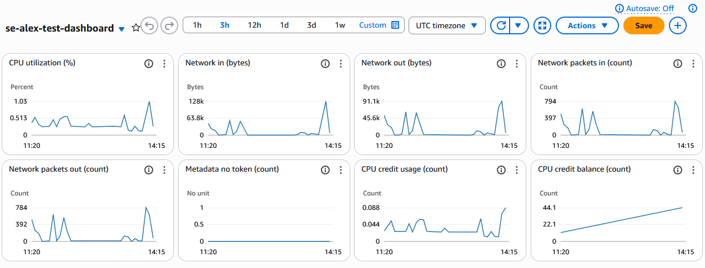

    - After about 60s, the monitoring graph will update.

## Set up an alarm

    - Go to the cloudwatch section of the AWS website and click 'all alarms' at the side.

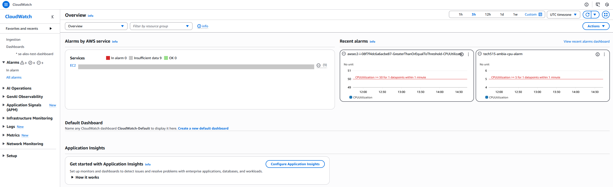

    - Click the orange 'Create Alarm' button in the top-right.
    - That will bring you to this page:

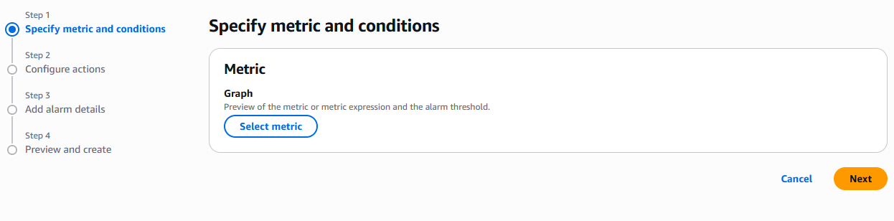

    - Click select metric to bring you to this screen:

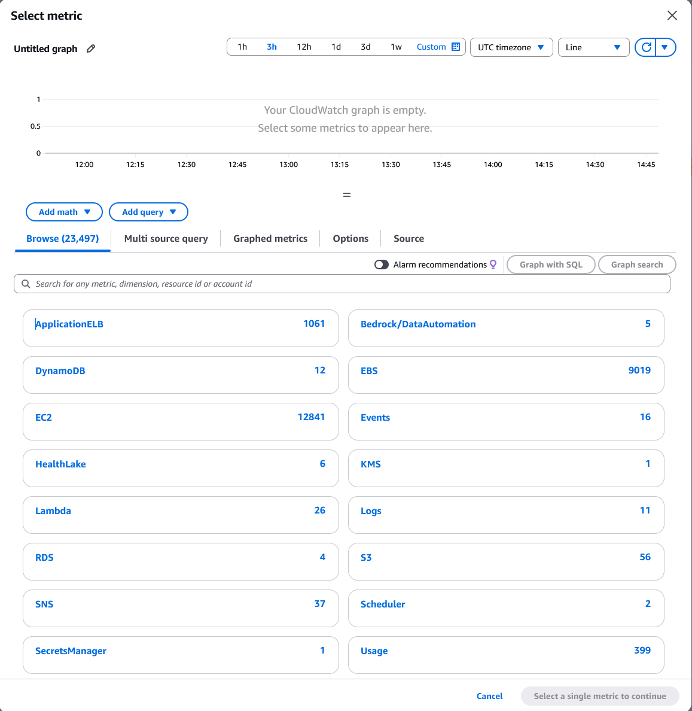

    - For this, I will go EC2 -> Across All Instances -> CPUUtilisation.

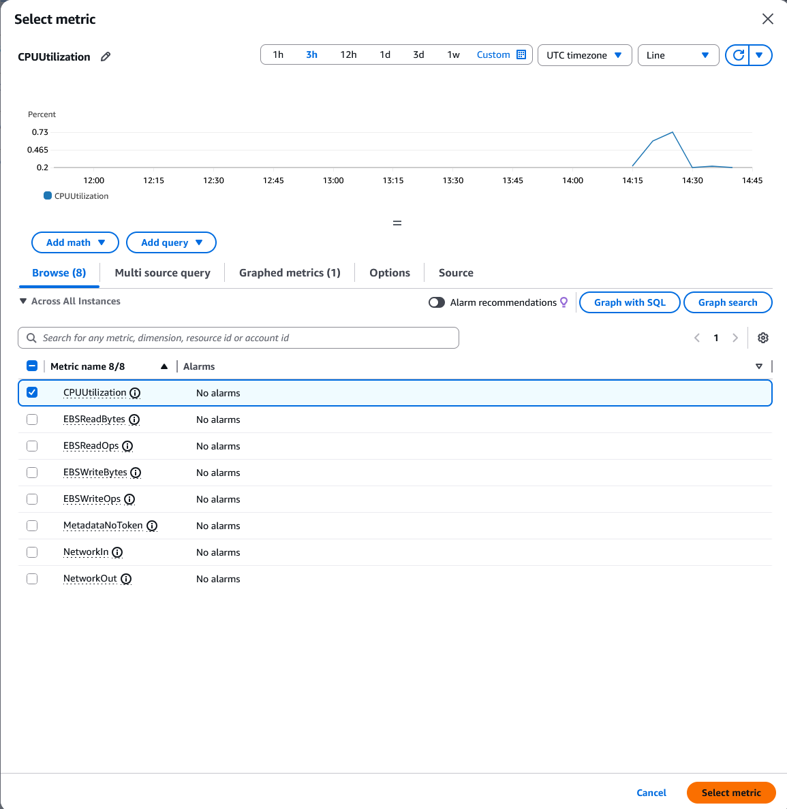
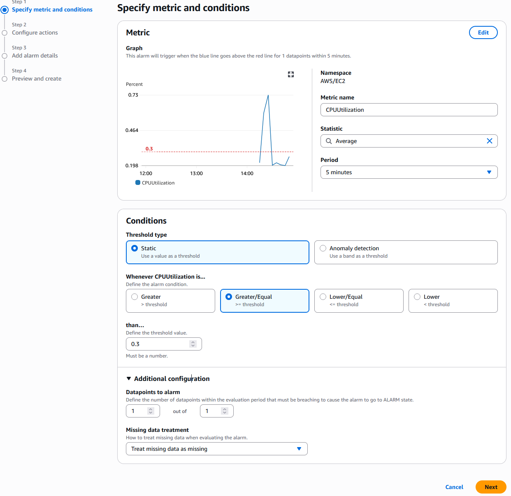
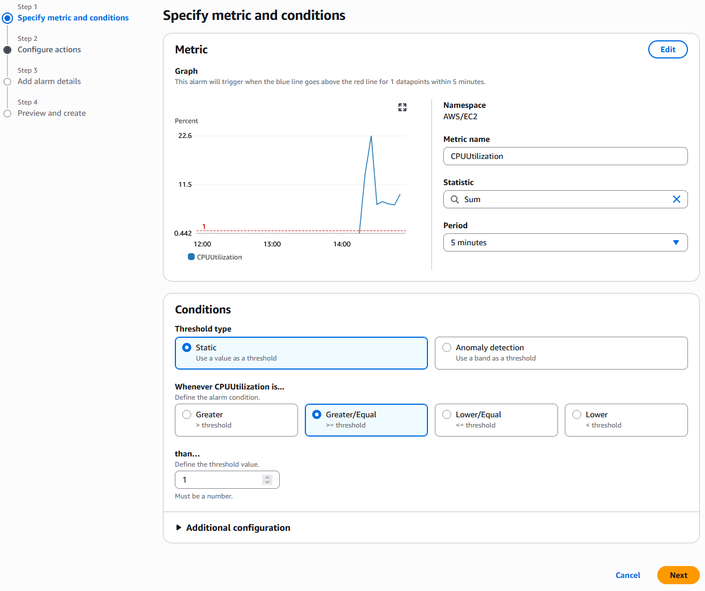

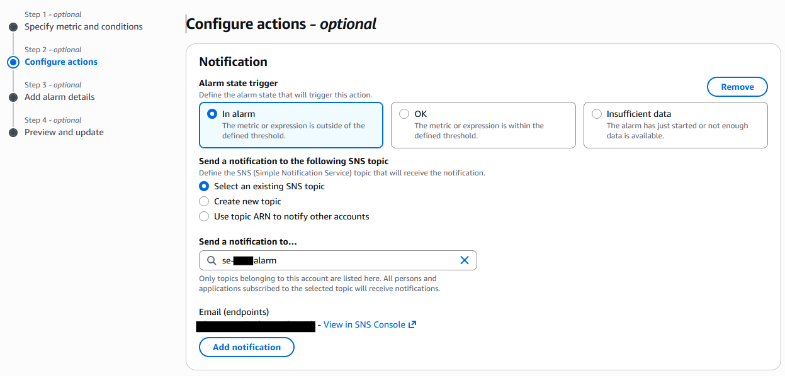
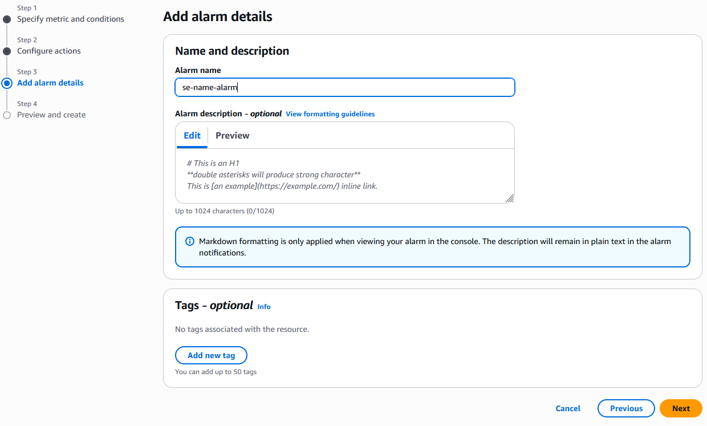
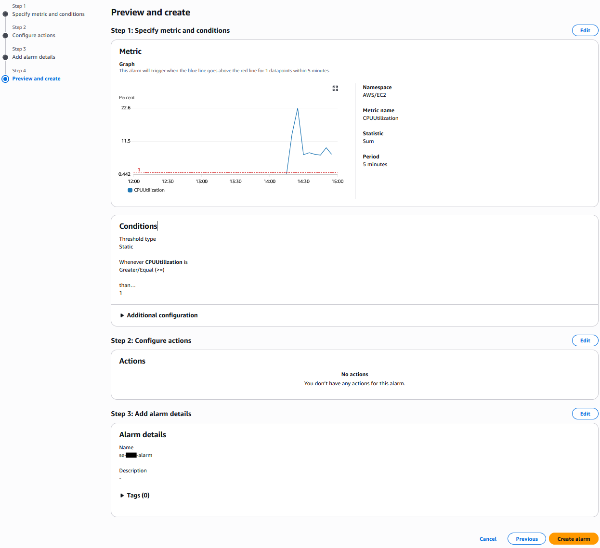

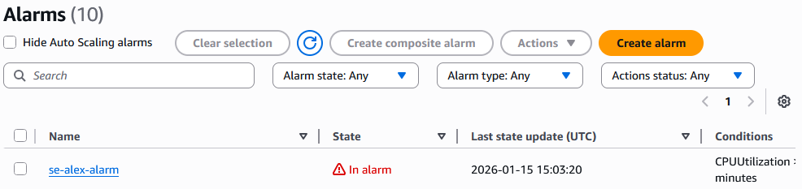

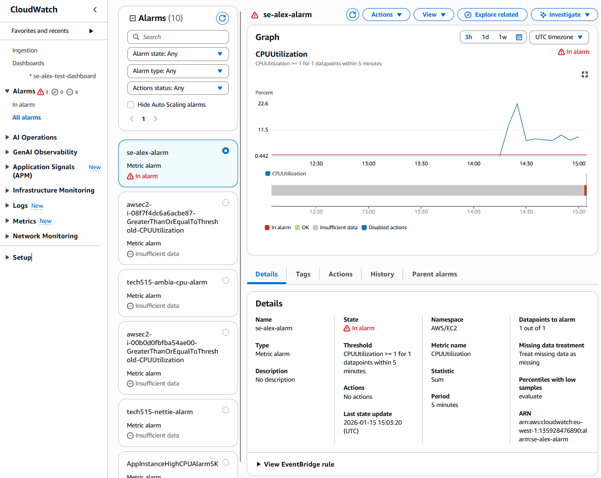

    - Notifications:
    
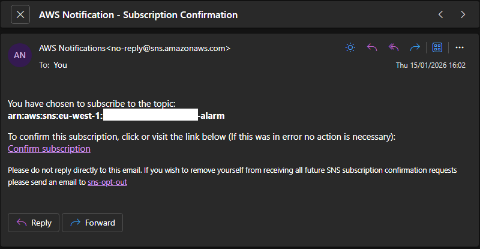
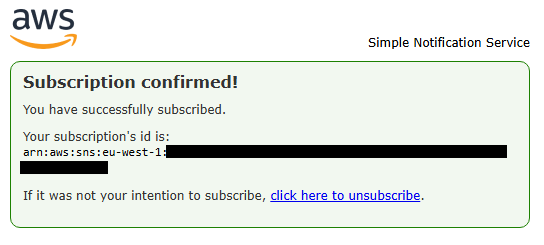

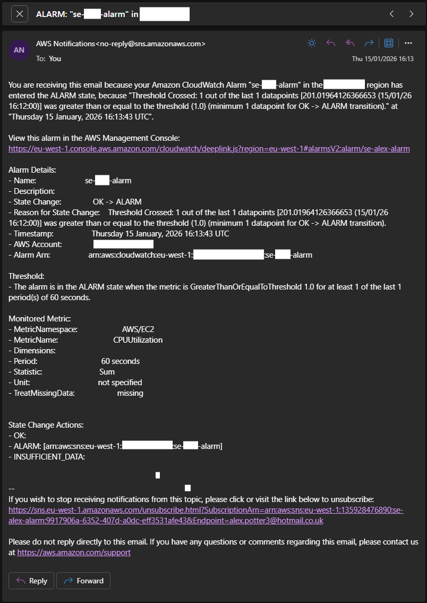